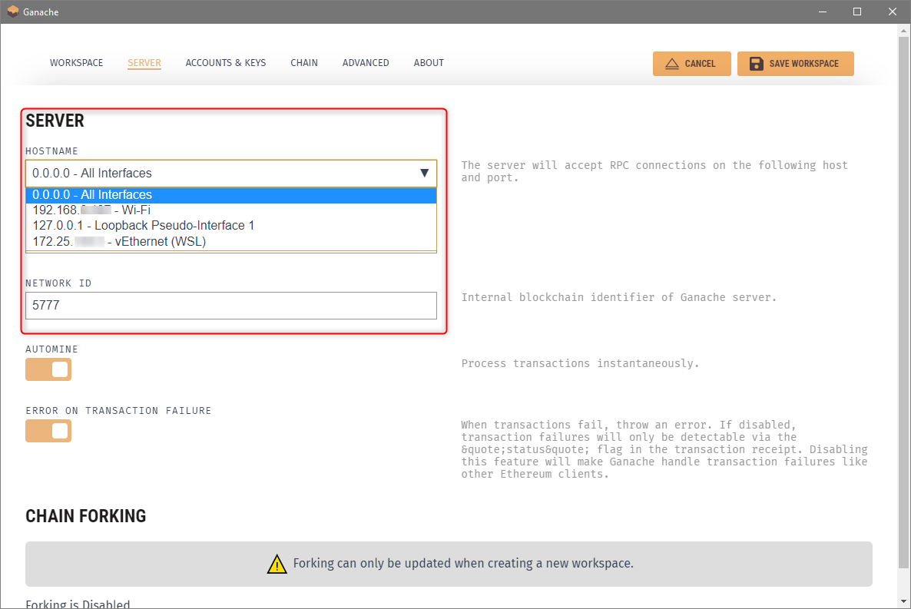
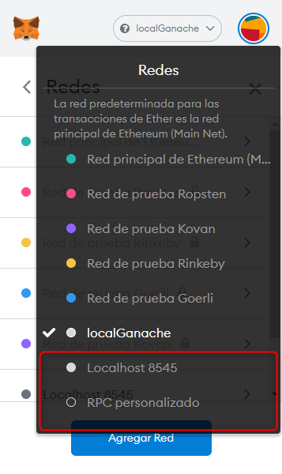
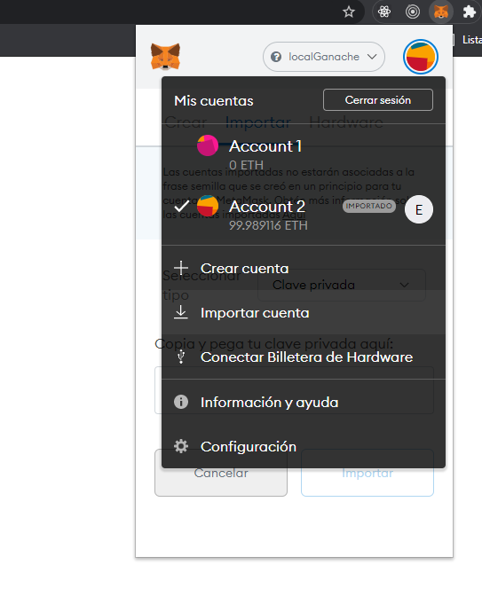

# Voting Decentralized Application

## Environment Setup

### 1. Dependencies
#### 1.1 Install [Nodejs](https://nodejs.org/es/) and npm
#### 1.2 [Truffle package](https://github.com/trufflesuite/truffle)  
`$ npm install -g truffle` 
#### 1.3 [Ganache-cli package](https://github.com/trufflesuite/ganache-cli) 
`$ npm install -g ganache-cli` 

### 2. Ganache desktop application
[Install Ganache](https://www.trufflesuite.com/ganache)
<br> 
### 3. MetaMask chrome extension
[Install MetaMask](https://metamask.io/)
<br> 

## Run Application
Build blockchain network
```shell
$ ganache-cli
```
_Keep the session running_


Deploy the smart contract
```shell
$ truffle migrate --reset
```

Start dev server
```shell
$ npm run dev
```


## Ganache Configuration
Config host address


## MetaMask Configuration

Config network



Import account using the private key provided when the blockchain network is built




## [Reference](https://www.dappuniversity.com/articles/the-ultimate-ethereum-dapp-tutorial)
